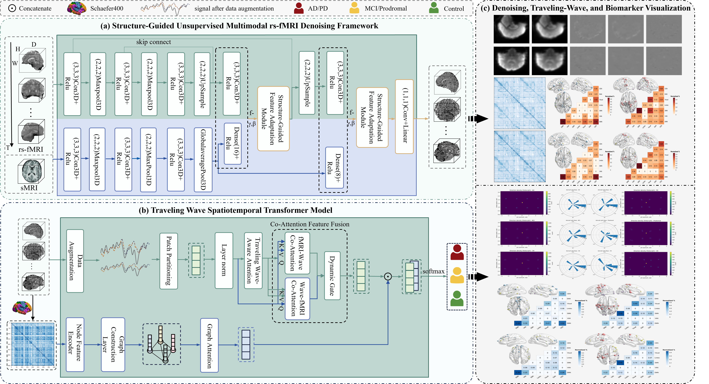

# TWTSD: Traveling-Wave Spatiotemporal Transformer with Structure-Guided Denoising



## 1. Overview

TWTSD is a PyTorch / PyTorch Lightning implementation of a **traveling-wave–aware spatiotemporal transformer** with **structure-guided unsupervised denoising** for rs-fMRI based disease spectrum identification.

The framework consists of three main components:

1. **Structure-guided denoising**  
   - Anatomical priors (e.g. T1/DWI-derived structure) are used to guide an unsupervised denoiser, improving SNR of 4D fMRI.

2. **4D Spatiotemporal Transformer Backbone**  
   - A Swin4D-like architecture that operates on 4D patches (H × W × D × T) and learns long-range spatiotemporal dependencies.

3. **Traveling-Wave–Aware Attention & Metrics**  
   - Window-based self-attention is augmented with explicit phase-lag modeling.  
   - We extract direction, speed and lag-spectrum of BOLD propagation as quantitative traveling-wave biomarkers.

If you use this code in your research, please consider citing the corresponding paper / preprint (see [Citation](#8-citation)).

---

## 2. Features

- ✅ End-to-end PyTorch Lightning training / evaluation
- ✅ 4D Swin-style transformer (`WindowAttention4D`)
- ✅ Contrastive pretraining (instance-wise & local-local temporal losses)
- ✅ Classification & regression heads (sex / diagnosis / age / cognitive score)
- ✅ Traveling wave metrics extraction:
  - Lag spectrum
  - Direction consistency
  - Speed map in mm/s
  - Voxel-wise vector field (positions and vectors in MNI space)
- ✅ Subject-level metrics aggregation and logging

---

## 4. Installation

### 4.1 Clone

```bash
git clone https://github.com/katouMegumiH/TWTSD.git
cd TWTSD
```

### 4.2 Create Environment

```
conda create -n twtsd python=3.10 -y
conda activate twtsd
pip install -r requirements.txt
```

##  5. Traveling Wave Extraction

Activation of the travelling wave mechanism:

```
--extract_wave_metrics True
--TR 2.0
--voxel_spacing 3.0 3.0 3.0
--wave_save_dir wave_metrics
```

Each subject will retain:

```
wave_metrics/sub_<ID>.pt
```

## Contact

	•	Maintainer: Zihan Li
	•	Email: katoumegumi.h@gmail.com